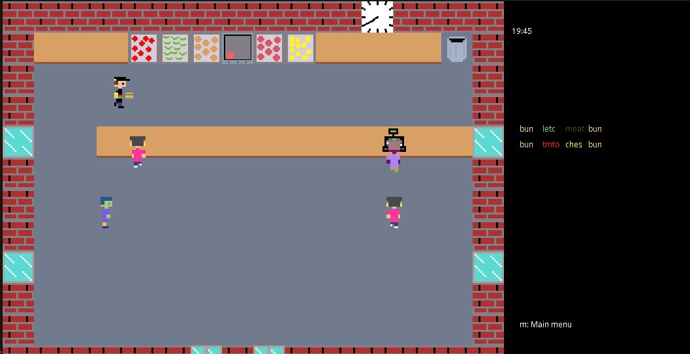

# Burger-Baron
Cooking game made with Java swing libraries.



Try to keep up as you please your customers with their various specific burger orders. Use the arrows to move and press 'g' for action.

For compilation, travel to the top of the directory and run:
```bash
javac -d bin -cp src:src/res src/main/*.java src/entity/*.java src/tile/*.java src/item/*java src/queue/*.java src/time/*.java
```

Then to run:
```bash
java -cp bin:src main.Main
```

